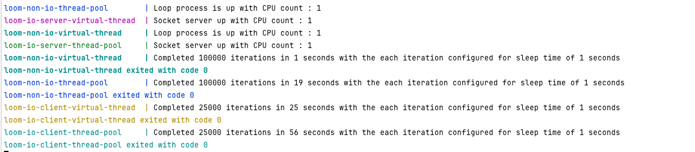

# Virtual Thread vs Platform Thread

A simple POC to explore the new virtual thread (introduced in Java 21) , and compare its performance with traditional platform thread.

### Platform Thread (https://docs.oracle.com/javase/8/docs/api/java/lang/Thread.html) :
    1. Heavy thread, hence generally pooled
    2. Costlier
    3. Thread is pooled to achieve optimal scalability
    4. May or may not preserve the thread-per-request model, depends on asynchronous/synchronous model

### Virtual Thread (https://openjdk.org/jeps/444) :
    1. Lightweight thread, hence create as you need
    2. Cheap
    3. Thread should NOT be pooled, yet achieves optimal scalability better than platform thread
    4. Preserves the thread-per-request model
    5. Virtual threads are not faster threads — they do not run code any faster than platform threads. They exist to provide scale (higher throughput), not speed (lower latency)

### About the modules :
    1. loop   - A simple Non-IO based looping logic that has examples for both Platform Thread & Virtual Thread 
    2. server - A socket based IO server that has examples for both Platform Thread & Virtual Thread
    3. client - A socket based IO client that has examples for both Platform Thread & Virtual Thread, which invokes the corresponding server on loop

### Pre-req :
    1. Java 22
    2. Container runtimes like Docker (Docket desktop/colima)

### Build :
``` bash
./mvnw clean install
docker build -t loom-server server
docker build -t loom-client client
docker build -t loop loop
```
### Run :
_1. Run the IO based server & client to test Thread Pool implementation :_
``` bash
docker compose up looptp 
```
_2. Run the IO based server & client to test Virtual Thread implementation :_
``` bash
docker compose up loopvt
```
_3. Run the IO based server & client to test Platform Thread/Thread Pool implementation :_
``` bash
docker compose up loomservertp loomclienttp
```
_4. Run the IO based server & client to test Virtual Thread implementation :_
``` bash
docker compose up loomservervt loomclientvt 
```
_5. Run all at once :_
``` bash
docker compose up
```

### Sample Result :

### Conclusion
    Upon multiple benchmarking runs, results are defintely better compared to platform thread, but still play around it with different number of iterations, thread pool executors, thread counts, thread sleep time etc..
    This repo provides the basic setup handy for you to do the POC for yourself, and intentionally skipping the detailed benchmarking numbers.


### References
https://docs.oracle.com/en/java/javase/21/core/virtual-threads.html#GUID-2DDA5807-5BD5-4ABC-B62A-A1230F0566E0
